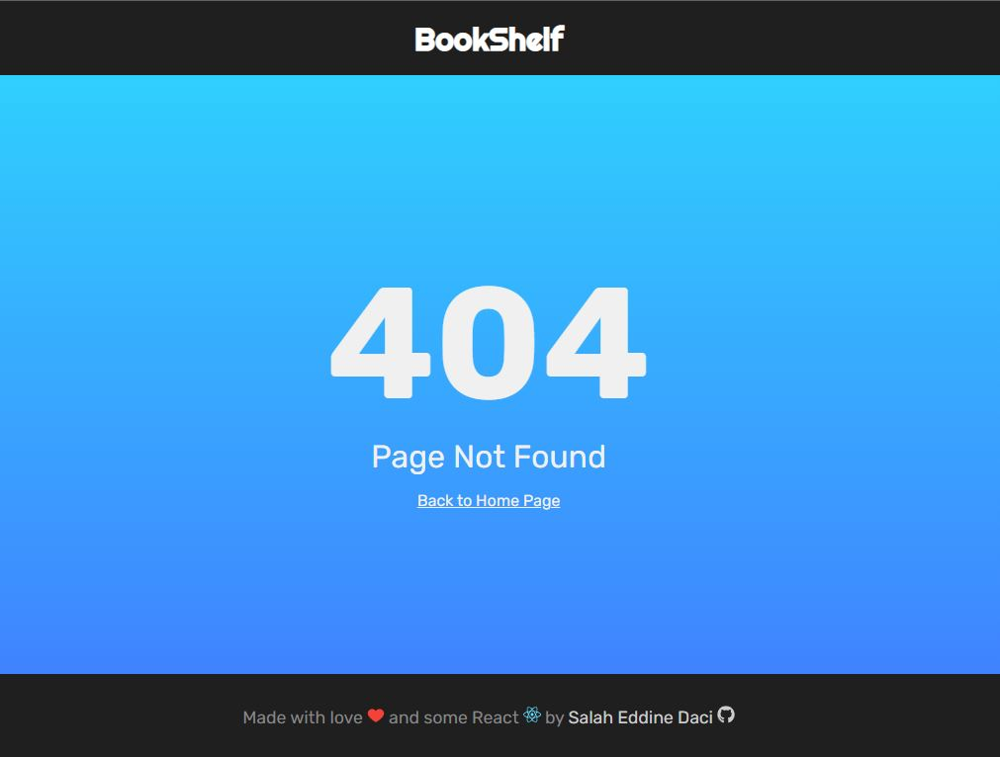

# BookShelf: A Book Tracking App

##### Book Shelf is a simple react project for [Udacity’s React Fundamentals course](https://www.udacity.com/course/react-nanodegree--nd019).

# App Functionality

In this application, the main page displays a list of **"shelves"** (i.e. categories), each of which contains a number of books. The three shelves are:

- **Currently Reading**
- **Want to Read**
- **Read**
  

The main page also has a link to **_/search_** , a search page that allows you to find books to add to your library.

if you typed another link the app with redirect you to **error 404 page**

## To run the app you need to:

### In the project directory, you can run:

##### 1. `npm install` to install all project dependencies.

##### 2. `npm start` start the development server in http://localhost:3000/

